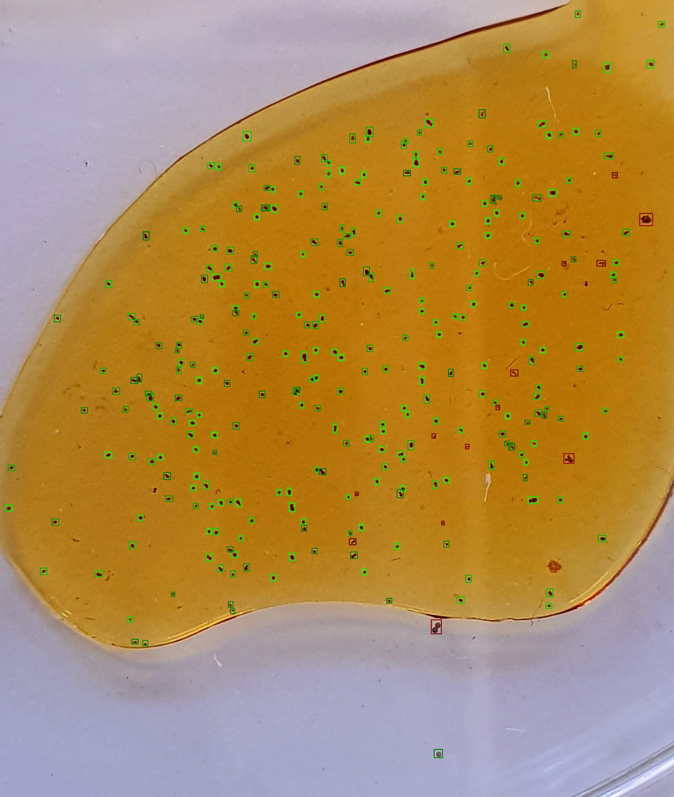

## Backend

This repo contains the backend(gunicorn, flask, and darknet model) for ilytics.sg.


## Run Instruction


1. Clone this repository & checkout to the correct branch

 - `git clone https://github.com/dsaidgovsg/ilytics.git`

2. Navigate into the repository

 - `cd ilytics`
 - `git fetch -a`
 - `git checkout -t origin/handover_sfa_gpu`

3. Create a folder name **aimodel**

4. Ensure that the 4 files are in ./aimodel folder before running the following steps.

> 1. `.cfg`
> 2. `.data` 
> 3. `.names`
> 4. `.weights`

5. Build the docker image
 `docker build . --no-cache --tag ilytics_backend_gpu`

6. Run the docker container
 `docker run --gpus=all --name ilytics_backend_gpu_container -itd -p 8080:8080 ilytics_backend_gpu`

7. Run the following command and ensure that the output is similar to the output below
```
docker logs ilytics_backend_gpu_container
```
> `Getting weights from S3`  
> `running gunicorn...`  
> `[2021-03-04 03:34:47 +0000] [7] [INFO] Starting gunicorn 20.0.4`  
> `[2021-03-04 03:34:47 +0000] [7] [INFO] Listening at: http://0.0.0.0:8080 (7)`  
> `[2021-03-04 03:34:47 +0000] [7] [INFO] Using worker: sync`  
> `[2021-03-04 03:34:47 +0000] [10] [INFO] Booting worker with pid: 10`  

8. Your Backend is up and running!

# Endpoints

## Health check

### Request

`GET /ping/`

    curl -i '0.0.0.0:8080/ping'

### Response
    HTTP/1.1 200 OK
    Server: gunicorn
    Date: Thu, 11 May 2023 02:12:42 GMT
    Connection: close
    Content-Type: application/json
    Content-Length: 22
    Access-Control-Allow-Origin: *

    {
    "data": "pong!"
    }

## Get inference

### Request

`POST /invocations`

If content type of HTTP request is `application/json`

| Field name | Field type | Required | Description                            |
| ---------- | ---------- | -------- | -------------------------------------- |
| `image`    | string     | required | Contains base64 encoded image content. |
| `filename` | string     | required |                                        |

    curl -i --location --request POST '0.0.0.0:8080/invocations' \
    --header 'Content-Type: application/json' \
    --data-raw '{
        "image": "/9j/4AAQS/...",
        "filename": "dog.jpg"
    }'

If content type is `multipart/form-data`

| Field name | Field type | Required | Description                    |
| ---------- | ---------- | -------- | ------------------------------ |
| `image`    | string     | required | Contains the raw image content |
| `filename` | string     | required |


    curl -i --location --request POST '0.0.0.0:8080/invocations' \
    --header 'Content-Type: multipart/form-data' \
    -F filename='dog.jpg' \
    -F image=@"20191114_141523.jpg"

### Response

| Field name | Field type | Description                            |
| ---------- | ---------- | -------------------------------------- |
| `img`      | string     | Contains base64 encoded image content. |
| `stat`     | JSON       | Contain output from the model          |


    HTTP/1.1 200 OK
    Server: gunicorn
    Date: Thu, 11 May 2023 03:27:16 GMT
    Connection: close
    Content-Type: application/json
    Content-Length: 988
    Access-Control-Allow-Origin: *

    {
    "img": "/9j/4AAQSkZJRgABAQAAAQABAAD/...", 
    "stat": {
        "": 0, 
        "Ciliates": 7, 
        "Clumps": 6, 
        "Dead": 0, 
        "One-Egg-Carrier": 62, 
        "Rotifer": 254
        }
    }

`img` contains the processed image with boxes around the targets.



# Sample code

Sample code can be found in the __tests__ folder

### Sending a ping
    requests.get("http://0.0.0.0:8080/ping")

### Sending an invocation using `application/json`
    with open(test_image_location, "rb") as test_img:
        encoded_data = base64.b64encode(test_img.read())
        encoded_string = encoded_data.decode("utf-8")

    payload = {"image": encoded_string, "filename": test_image_location}

    response = requests.post(target_url, json=payload)

### Sending an invocation using `multipart/form-data`
    file = open(test_image_location, "rb")
    payload = {"image": (test_image_location, file),
               "filename": (None, test_image_location)}

    response = requests.post(target_url, files=payload)


# Debug

## Cuda out of memory error
If the gpu memory is not enough for the application, edit `./aimodel/*.cfg` file. Reduce the width and height to a multiple of 64.  
*Do note that reducing the dimensions will affect the accuracy. If accuracy is priority, use `handover_sfa_cpu branch` instead.*
> `Line 8:` ~~`width=832`~~ -> `width=640`  
> `Line 9:` ~~`height=832`~~ -> `height=640` 

## `run.sh` not found
Might be caused by line terminators. Run `file run.sh`.

Correct

    run.sh: Bourne-Again shell script, ASCII text executable

Wrong

    run.sh: Bourne-Again shell script, ASCII text executable, with CRLF line terminators
